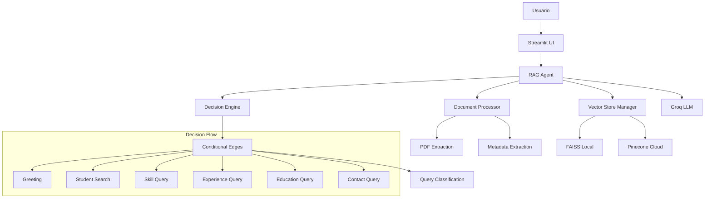

# 🎓 RAG Chatbot para CVs 

Sistema de generación de texto aumentada por recuperación (RAG) que permite consultar información de currículums vitae de estudiantes usando inteligencia artificial.

[Video de demostración del proyecto](https://drive.google.com/file/d/1My6rqdy_3eagCAvFpgDhFyG548A9lkDl/view?usp=sharing)

## 🚀 Características

- **RAG (Retrieval-Augmented Generation)**: Combina búsqueda semántica con generación de texto
- **Motor de Decisiones Inteligente**: Usa conditional edges para determinar el tipo de consulta
- **Almacenamiento Vectorial Dual**: Soporte para Pinecone (cloud) y FAISS (local)
- **Procesamiento Automático de PDFs**: Extrae información estructurada de CVs
- **Interface Web Moderna**: Built con Streamlit
- **Análisis de Consultas**: Clasificación automática usando regex y patterns

## 🛠️ Tecnologías aplicadas

- **Frontend**: Streamlit
- **LLM**: Groq (llama3-70b-8192)
- **Framework**: LangChain
- **Vector Store**: Pinecone / FAISS
- **Embeddings**: Sentence Transformers
- **PDF Processing**: PyPDF2

## 📋 Prerequisitos

- Python 3.8+
- API Key de Groq (obligatorio)
- API Key de Pinecone (opcional, usa FAISS local como alternativa)

## 🔧 Instalación

### 1. Clona el repositorio
```bash
git clone <url-del-repo>
cd rag-chatbot-cvs
```

### 2. Ejecuta el script de configuración
```bash
python setup.py
```

Este script:
- ✅ Verifica la versión de Python
- 📁 Crea directorios necesarios
- 📦 Instala dependencias
- 📝 Crea archivo .env template
- 🧪 Ejecuta tests básicos

### 3. Configura las variables de entorno

Edita el archivo `.env` con tus API keys:

```env
# OBLIGATORIO
GROQ_API_KEY=gsk_tu_api_key_aqui

# OPCIONAL (usa FAISS local si no tienes)
PINECONE_API_KEY=tu_pinecone_key_aqui
PINECONE_ENVIRONMENT=us-east-1-aws
PINECONE_INDEX_NAME=student-cv-index
```

### 4. Agrega CVs de estudiantes

Coloca archivos PDF en el directorio `cvs_estudiantes/`:
```
cvs_estudiantes/
├── cv_juan_perez.pdf
├── cv_maria_garcia.pdf
└── cv_carlos_lopez.pdf
```

### 5. Ejecuta la aplicación
```bash
streamlit run app.py
```

## 🎯 Uso

### Inicialización
1. Abre http://localhost:8501
2. En el panel lateral, selecciona el tipo de almacén vectorial
3. Haz clic en "🚀 Inicializar Sistema"
4. Procesa los documentos PDF con "🔄 Procesar Documentos"

### Tipos de Consultas Soportadas

El sistema usa **conditional edges** para clasificar consultas:

#### 🔍 Búsqueda de Estudiantes
```
"Busca información de Juan Pérez"
"Quien es María García"
"Datos del estudiante Carlos López"
```

#### 🛠️ Consultas de Habilidades
```
"Qué estudiantes saben Python"
"Quién tiene experiencia en Machine Learning"
"Estudiantes con conocimientos en JavaScript"
```

#### 💼 Experiencia Laboral
```
"Muéstrame experiencia laboral"
"Dónde han trabajado"
"Empresas donde trabajaron"
```

#### 🎓 Información Educativa
```
"Qué carreras han estudiado"
"Estudiantes de Ingeniería"
"Información sobre educación"
```

#### 📞 Datos de Contacto
```
"Información de contacto"
"Email de los estudiantes"
"Cómo contactar a..."
```

## 🏗️ Arquitectura



## 📁 Estructura del Proyecto

```
proyecto_rag/
├── app.py                  # Aplicación Streamlit principal
├── config.py              # Configuración del sistema
├── decision_engine.py     # Motor de decisiones con conditional edges
├── document_processor.py  # Procesamiento de PDFs
├── vector_store.py        # Gestión de almacén vectorial
├── rag_agent.py           # Agente RAG principal
├── setup.py               # Script de configuración
├── requirements.txt       # Dependencias
├── .env                   # Variables de entorno
├── README.md              # Esta documentación
├── cvs_estudiantes/       # Directorio de PDFs
├── vector_store/          # Índice FAISS local
└── logs/                  # Logs del sistema
```

## 🧠 Motor de Decisiones

El sistema implementa **conditional edges** usando la librería `re` para clasificar consultas:

### Patrones Regex por Tipo

```python
# Ejemplo de patrones para búsqueda de estudiantes
patterns = [
    r"busca[r]?\s+estudiante[s]?\s+(?:llamado[s]?|de nombre)\s+(\w+)",
    r"quien es\s+(\w+)",
    r"información de\s+(\w+)"
]
```

### Flujo de Decisión

1. **Análisis de Entrada**: Regex matching para clasificar tipo de consulta
2. **Extracción de Entidades**: Nombres, habilidades, etc.
3. **Estrategia de Búsqueda**: Determina filtros y templates
4. **Decisión RAG**: ¿Usar búsqueda vectorial o respuesta directa?

## 🔍 Procesamiento de PDFs

### Extracción de Metadatos

El sistema extrae automáticamente:

- **Nombre del estudiante**
- **Información de contacto** (email, teléfono)
- **Habilidades técnicas**
- **Experiencia laboral**
- **Información educativa**

### Ejemplo de CV Bien Estructurado

```
JUAN PÉREZ GARCÍA
Email: juan.perez@email.com
Teléfono: +1234567890

HABILIDADES:
- Python, JavaScript, SQL
- Machine Learning, Data Science
- React, Node.js

EXPERIENCIA LABORAL:
- Desarrollador Full Stack - TechCorp (2023-2024)
- Practicante de Desarrollo - StartupXYZ (2022)

EDUCACIÓN:
- Ingeniería en Sistemas - Universidad ABC (2020-2024)
- Curso Machine Learning - Coursera (2023)
```

## ⚙️ Configuración Avanzada

### Variables de Entorno Completas

```env
# LLM Configuration
GROQ_API_KEY=tu_groq_key
MODEL_NAME=mixtral-8x7b-32768
TEMPERATURE=0.1
MAX_TOKENS=1024

# Vector Store
PINECONE_API_KEY=tu_pinecone_key
PINECONE_ENVIRONMENT=us-east-1-aws
PINECONE_INDEX_NAME=student-cv-index

# Processing
CHUNK_SIZE=1000
CHUNK_OVERLAP=200
TOP_K_RETRIEVAL=5

# Directories
PDF_DIRECTORY=cvs_estudiantes
VECTOR_STORE_PATH=vector_store
```

### Personalización de Modelos

```python
# En config.py
EMBEDDING_MODEL = "sentence-transformers/all-MiniLM-L6-v2"
MODEL_NAME = "llama2-70b-4096"  # Cambiar modelo de Groq
```

## 🧪 Testing

### Ejecutar Tests Básicos
```bash
python setup.py
```

### Test Manual
```bash
python -c "
from config import Config
from rag_agent import RAGAgent
print('✅ Módulos importados correctamente')
"
```

## 🚨 Troubleshooting

### Problemas Comunes

#### 1. Error de API Key
```
❌ Error: API key not found
```
**Solución**: Verifica que el archivo `.env` tenga la clave correcta

#### 2. Pinecone Connection Error
```
❌ Error al conectar con Pinecone
```
**Solución**: El sistema automáticamente usa FAISS local como respaldo

#### 3. No PDF Files Found
```
⚠️ No se encontraron archivos PDF
```
**Solución**: Agrega archivos PDF al directorio `cvs_estudiantes/`

#### 4. Memory Issues with Large PDFs
```
❌ Memory error during processing
```
**Solución**: Reduce `CHUNK_SIZE` en config.py o procesa menos archivos

### Logs y Debug

```bash
# Activar debug mode
export DEBUG=1
streamlit run app.py
```

## 🚀 Despliegue

### Local Development
```bash
streamlit run app.py
```

### Docker (Opcional)
```dockerfile
FROM python:3.9-slim
COPY . /app
WORKDIR /app
RUN pip install -r requirements.txt
EXPOSE 8501
CMD ["streamlit", "run", "app.py", "--server.port=8501", "--server.address=0.0.0.0"]
```

### Cloud Deployment
- Streamlit Cloud
- Heroku
- AWS EC2
- Google Cloud Run

## 📈 Métricas y Monitoreo

El sistema proporciona:
- **Estadísticas de procesamiento**
- **Métricas de confianza** por respuesta
- **Conteo de vectores** en almacén
- **Top habilidades** encontradas

## 🤝 Contribuir

1. Fork el repositorio
2. Crea una rama feature (`git checkout -b feature/nueva-funcionalidad`)
3. Commit cambios (`git commit -am 'Agrega nueva funcionalidad'`)
4. Push a la rama (`git push origin feature/nueva-funcionalidad`)
5. Crea un Pull Request

## 👥 Autores

- **JUAN RUIZ OTONDO** - *PRIMER AGENTE* - [https://github.com/j5675293/RAG-CHATBOT-PNL-II)

## 🙏 Agradecimientos

- LangChain por el framework RAG
- Groq por el modelo LLM
- Streamlit por la interfaz web
- Pinecone por el almacén vectorial
- Sentence Transformers por los embeddings

---

⭐ **¡Si este proyecto te es útil, dale una estrella!** ⭐
